# VASProcar

[](https://www.gnu.org/licenses/gpl-3.0)
[](https://doi.org/10.5281/zenodo.6343960)

Post-processing for **VASP** and **Quantum ESPRESSO** electronic-structure
calculations, through an interactive menu. Band structures, spin textures,
projected DOS, charge densities and the file tools around them — without
writing a parser.

- **New here?** → [Your first figure in 10 minutes](docs/quickstart-vasp.md)
- **Quantum ESPRESSO?** → [QE guide](docs/quickstart-qe.md) *(file naming matters — read it first)*
- **Looking for a specific task?** → [Option reference](docs/options.md)
- **Running unattended / in a batch queue?** → [Automation](docs/automation.md)
- **Something went wrong?** → [Troubleshooting](docs/troubleshooting.md)

---

## Install

```bash
pip install vasprocar
```

Works on **Linux, macOS and Windows**, Python 3.8+. A virtual environment is
recommended, and required if you plan to run VASProcar from a scheduler.

> [!WARNING]
> After installing, launch it with **`python -m vasprocar`**, not the bare
> `vasprocar` command. The console-script entry point is broken in released
> versions up to and including 1.1.20.061 and exits with
> `ImportError: cannot import name 'main'`.

Installed automatically: NumPy, SciPy, Matplotlib, Plotly, MoviePy, Kaleido,
Requests.

Two features need a package that is **not** installed automatically:

| Feature | Needs | Install |
|---|---|---|
| `[51]` POSCAR manipulation | pymatgen | `pip install pymatgen` |
| SIESTA backend | sisl | `pip install sisl` |

## Run

```bash
cd /path/to/your/calculation
python -m vasprocar
```

VASProcar reads the calculation in the **current directory** and writes
everything it produces into `./output/`.

You can also pass the directory as an argument, but it **must be an absolute
path**:

```bash
python -m vasprocar /absolute/path/to/your/calculation   # works
python -m vasprocar ./my-calculation                     # fails
```

> [!CAUTION]
> A **relative** path argument fails with
> `FileNotFoundError: .../output` and, before that, silently defeats backend
> detection — so the tool may ask which DFT code you used, and then run the
> wrong parser on your files. Use `cd`, or an absolute path.

## What files do I need?

For the analysis menus (`[1]`–`[4]`), in the directory you run from:

| | VASP |
|---|---|
| **Always** | `CONTCAR` (or `POSCAR`), `OUTCAR`, `PROCAR` |
| Band-structure labels | `KPOINTS` in line mode, **with a label on every k-point line** |
| DOS `[30]` | `DOSCAR` |
| Potential `[40]` | `LOCPOT` |
| Charge density `[41]` | `CHGCAR` |
| Partial charge `[42]` | `PARCHG` |
| Dielectric function `[43]` | `vasprun.xml` from a `LOPTICS = .TRUE.` run |

`PROCAR` only exists if you set **`LORBIT = 11`** in your INCAR. Without it,
every projection feature is unavailable.

The file tools in `[5]` are the exception: they need only the file you point
them at.

For Quantum ESPRESSO the required files and their **exact expected names** are
in the [QE guide](docs/quickstart-qe.md). Read it before your first run —
VASProcar's expectations differ from the usual QE tutorial naming, and a
mismatch is not always reported clearly.

## Which option do I want?

```mermaid
flowchart TD
    A[What do you want?] --> B[Check what VASProcar sees<br/>type 999]
    A --> C[Bands along a k-path]
    A --> D[Something vs. energy at fixed k]
    A --> E[Spin]
    A --> F[Orbital / atomic character]
    A --> G[Density of states]
    A --> H[Charge / potential / optics]
    A --> I[Make or fix an input file]

    C --> C1["10  2D bands"]
    C --> C2["13  3D bands"]
    D --> D1["11  constant-energy contours"]
    D --> D2["12  one band, many contours"]
    D --> D3["14  isosurface"]
    E --> E1["20  Sx,Sy,Sz on bands"]
    E --> E2["21  textures 2D/3D"]
    E --> E3["22  on a contour"]
    E --> E4["23  video"]
    F --> F1["31  orbitals S,P,D,F"]
    F --> F2["32  atomic"]
    F --> F3["33  character"]
    F --> F4["35  table + penetration length"]
    G --> G1["30  DOS, pDOS, lDOS"]
    H --> H1["40 potential · 41 charge<br/>42 partial · 43 dielectric"]
    I --> I1["50 convert · 52 substitute<br/>54 KPOINTS · 55 POTCAR<br/>56 repair"]
```



Full list, including which numbers each backend accepts:
**[Option reference](docs/options.md)**.

> [!IMPORTANT]
> `30` is the density of states and `31` is the orbital projection.
> Documentation published before 2026-08-25 had these two swapped, along with
> four of the `[5]` file-tool numbers. If you are working from an older guide,
> check [the reference](docs/options.md) before you trust a figure.

## Output

Everything lands in `./output/`, in a subdirectory per task — `Bands/`,
`Spin/`, `DOS/`, `Orbitals/` and so on. Each task writes:

- a **`.dat`** file — the numbers, for your own plotting
- a **`.png`** (and optionally pdf/svg/eps) — the figure
- a **`.py`** script — the matplotlib code that made the figure, so you can
  restyle it without re-running the analysis
- optionally a **`.agr`** file for [Grace/xmgrace](https://plasma-gate.weizmann.ac.il/Grace/)

One exception: `[54]` writes to `KPOINTS_generated/`, not `output/`.

## Citing

Please cite the DOI [10.5281/zenodo.6343960](https://doi.org/10.5281/zenodo.6343960).
BibTeX is written to `output/BibTeX.dat` on every run.

## Repositories and support

[Zenodo](https://doi.org/10.5281/zenodo.6343960) ·
[GitHub](https://github.com/Augusto-de-Lelis-Araujo/VASProcar-Python-tools-VASP) ·
[PyPI](https://pypi.org/project/vasprocar)

Questions and bug reports: open a GitHub issue, or email
augusto-lelis@outlook.com. When reporting a problem, please include the
version (`python -m vasprocar` prints it on the first line), your OS, and
`output/info.txt` if you got that far.
